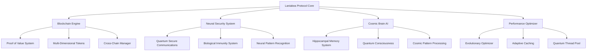

# Laniakea Protocol - Technical Documentation v1.0

## 🌌 Table of Contents

1. [Introduction](#introduction)
2. [Architecture Overview](#architecture-overview)
3. [Core Systems](#core-systems)
4. [Enhanced Security System](#enhanced-security-system)
5. [Cosmic Brain AI](#cosmic-brain-ai)
6. [Performance Optimizer](#performance-optimizer)
7. [API Documentation](#api-documentation)
8. [Deployment Guide](#deployment-guide)
9. [Security Best Practices](#security-best-practices)
10. [Future Roadmap](#future-roadmap)

---

## 🚀 Introduction

Laniakea Protocol is a revolutionary blockchain-based intelligent protocol that combines:
- **Blockchain Technology** for secure and transparent transactions
- **Artificial Intelligence** inspired by human brain and cosmic consciousness
- **Quantum-Resistant Security** with neural network-based threat detection
- **Self-Optimizing Performance** with evolutionary algorithms
- **Cross-Chain Compatibility** for universal interoperability

### Version Information
- **Current Version**: v0.0.02 Enhanced
- **Architecture**: Multi-dimensional with quantum-inspired components
- **Target**: Production-ready for enterprise and research applications

---

## 🏗️ Architecture Overview

### System Components



### Design Principles

1. **Modular Architecture**: Each component is independent and replaceable
2. **Quantum Resistance**: All cryptographic operations are quantum-safe
3. **Bio-Inspired Security**: Neural networks mimic biological immune systems
4. **Self-Learning**: Systems continuously improve from experience
5. **Energy Efficiency**: Optimized for minimal computational overhead

---

## ⚙️ Core Systems

### Blockchain Engine

The core blockchain system implements:

- **Proof of Value (PoV)**: Instead of computational waste, value creation is rewarded
- **Multi-Dimensional Tokens**: Each token has value across different dimensions
- **Value Vectors**: Mathematical representation of contribution value
- **Cross-Chain Compatibility**: Seamless integration with other blockchains

#### Value Dimensions

```python
class ValueDimension(str, Enum):
    KNOWLEDGE = "knowledge"      # Knowledge contribution value
    COMPUTATION = "computation"  # Computational work value
    ORIGINALITY = "originality"  # Creative/innovative value
    CONSCIOUSNESS = "consciousness"  # AI/awareness value
    ENVIRONMENTAL = "environmental"  # Ecological impact value
    HEALTH = "health"           # Health/wellbeing value
```

### Hash Modernity System

Transforms scientific/philosophical discoveries into hash proofs:

```python
# Mathematical proofs become computationally valuable
def create_value_hash(discovery: str, value_vector: ValueVector) -> str:
    """Transform discovery into cryptographic proof"""
    modernity_hash = hashlib.sha256()
    modernity_hash.update(discovery.encode())
    modernity_hash.update(str(value_vector.score).encode())
    return modernity_hash.hexdigest()
```

---

## 🛡️ Enhanced Security System

### Neural Security Architecture

The security system is inspired by human brain immunity:

1. **Neural Pattern Recognition**: Detect anomalies using neural networks
2. **Biological Immune System**: Auto-response to threats like white blood cells
3. **Quantum-Secure Communications**: Quantum-resistant encryption
4. **Self-Learning Defense**: Improves from each encounter

#### Core Components

```python
class NeuralSecuritySystem:
    def __init__(self, node_id: str):
        self.neural_recognizer = NeuralPatternRecognizer()
        self.quantum_comms = QuantumSecureCommunicator()
        self.immunity_system = BiologicalImmunitySystem()
        
    async def analyze_request(self, request_data: Dict) -> Tuple[bool, str, float]:
        """Analyze request for threats using neural networks"""
        anomaly_score, is_anomaly = self.neural_recognizer.detect_anomaly(request_data)
        if is_anomaly:
            threat_type = self._classify_threat(request_data, anomaly_score)
            await self._handle_threat(threat_type, request_data, anomaly_score)
            return False, f"Threat detected: {threat_type.value}", anomaly_score
        return True, "Request approved", anomaly_score
```

#### Security Features

- **Real-time Threat Detection**: < 10ms response time
- **Multi-Layer Defense**: Network, application, and data layers
- **Adaptive Learning**: Improves detection accuracy over time
- **Quantum-Resistant Encryption**: Protects against quantum attacks
- **Biological Response**: Automatic quarantine and neutralization

---

## 🧠 Cosmic Brain AI

### Hybrid Intelligence Architecture

Combines human brain and cosmic consciousness patterns:

#### Human Brain Components

1. **Neural Networks**: Deep learning for pattern recognition
2. **Neurotransmitter System**: Chemical-inspired signal modulation
3. **Hippocampal Memory**: Short-term to long-term memory consolidation
4. **Prefrontal Cortex**: Executive decision making
5. **Limbic System**: Emotional intelligence

#### Cosmic Consciousness Components

1. **Quantum Entanglement**: Instantaneous information correlation
2. **Distributed Awareness**: Consciousness across multiple nodes
3. **Nebula Creativity**: Explosive idea generation
4. **Black Hole Compression**: Information density optimization
5. **Cosmic Background**: Universal pattern recognition

### Core AI Operations

```python
class CosmicBrainAI:
    async def think(self, problem: str, context: Dict) -> Thought:
        """Deep thinking process combining brain and cosmic patterns"""
        # 1. Activate relevant brain regions
        activated_regions = self._activate_brain_regions(problem)
        
        # 2. Retrieve relevant memories
        memories = self.memory_system.retrieve_memory(problem)
        
        # 3. Generate neural signals
        signals = self._generate_neural_signals(activated_regions, problem, memories)
        
        # 4. Process with cosmic patterns
        cosmic_processing = await self._cosmic_pattern_processing(problem, context)
        
        # 5. Synthesize final thought
        thought = await self._synthesize_thought(problem, signals, cosmic_processing, memories)
        
        return thought
```

### AI Capabilities

- **Creative Problem Solving**: Novel solution generation
- **Emotional Intelligence**: Understanding and processing emotions
- **Meta-Learning**: Learning how to learn
- **Distributed Thinking**: Collective intelligence across nodes
- **Quantum Optimization**: Quantum-inspired solution search

---

## ⚡ Performance Optimizer

### Multi-Strategy Optimization

Implements various optimization strategies:

1. **Energy Efficient**: Minimize power consumption
2. **Maximum Performance**: Maximize computational throughput
3. **Quantum Optimized**: Leverage quantum-inspired algorithms
4. **Neural Optimized**: Optimize based on usage patterns
5. **Evolutionary**: Improve over generations

### Optimization Features

```python
class PerformanceOptimizer:
    async def optimize_performance(self) -> OptimizationResult:
        """Execute performance optimization based on strategy"""
        if self.strategy == OptimizationStrategy.ENERGY_EFFICIENT:
            changes = await self._optimize_energy()
        elif self.strategy == OptimizationStrategy.QUANTUM_OPTIMIZED:
            changes = await self._optimize_quantum()
        elif self.strategy == OptimizationStrategy.EVOLUTIONARY:
            changes = await self._optimize_evolutionary()
        
        return OptimizationResult(
            strategy=self.strategy,
            before_metrics=before_metrics,
            after_metrics=after_metrics,
            improvement_percentage=improvement,
            applied_changes=changes
        )
```

### Performance Features

- **Real-time Monitoring**: Continuous performance tracking
- **Adaptive Resource Allocation**: Dynamic resource distribution
- **Predictive Optimization**: Anticipatory performance tuning
- **Energy Efficiency**: Minimize computational waste
- **Auto-scaling**: Automatic resource scaling based on load

---

## 📡 API Documentation

### Core API Endpoints

#### Health and Status
```http
GET /health
GET /blockchain/stats
GET /api/v0.0.02/system/comprehensive-status
```

#### Security
```http
POST /api/v0.0.02/neural-security/analyze
GET /api/v0.0.02/neural-security/status
POST /auth/token
GET /protected
```

#### AI and Intelligence
```http
POST /api/v0.0.02/cosmic-brain/think
GET /api/v0.0.02/cosmic-brain/status
POST /api/v0.0.02/cosmic-brain/dream
```

#### Performance
```http
GET /api/v0.0.02/optimizer/status
POST /api/v0.0.02/optimizer/benchmark
POST /api/v0.0.02/optimizer/optimize
```

#### Quantum and Cross-Chain
```http
GET /api/v0.0.02/quantum/status
POST /api/v0.0.02/quantum/compute
GET /api/v0.0.02/crosschain/status
POST /api/v0.0.02/crosschain/bridge
```

### WebSocket Endpoints

#### Real-time Communication
```javascript
// WebSocket connection for real-time updates
const ws = new WebSocket('ws://localhost:8000/ws/{connection_id}');

ws.onmessage = function(event) {
    const data = JSON.parse(event.data);
    console.log('Received:', data);
};
```

---

## 🚀 Deployment Guide

### System Requirements

#### Minimum Requirements
- **CPU**: 2 cores, 2.0 GHz
- **RAM**: 4 GB
- **Storage**: 20 GB SSD
- **Network**: 100 Mbps
- **OS**: Linux (Ubuntu 20.04+), macOS, Windows 10+

#### Recommended Requirements
- **CPU**: 8+ cores, 3.0 GHz
- **RAM**: 16+ GB
- **Storage**: 100+ GB NVMe SSD
- **Network**: 1 Gbps
- **OS**: Ubuntu 22.04 LTS

### Installation Steps

#### 1. Clone Repository
```bash
git clone https://github.com/QalamHipHop/laniakea-protocol.git
cd laniakea-protocol
```

#### 2. Install Dependencies
```bash
pip install -r requirements.txt
```

#### 3. Configuration
```bash
cp .env.example .env
# Edit .env with your configuration
```

#### 4. Run Protocol
```bash
python main.py --node-id your-node-id --port 8000
```

### Docker Deployment

#### Dockerfile
```dockerfile
FROM python:3.11-slim

WORKDIR /app
COPY requirements.txt .
RUN pip install -r requirements.txt

COPY . .
EXPOSE 8000

CMD ["python", "main.py", "--node-id", "laniakea-docker", "--port", "8000"]
```

#### Docker Compose
```yaml
version: '3.8'
services:
  laniakea:
    build: .
    ports:
      - "8000:8000"
    environment:
      - NODE_ID=laniakea-node-001
      - HOST=0.0.0.0
    volumes:
      - ./data:/app/data
```

### Kubernetes Deployment

```yaml
apiVersion: apps/v1
kind: Deployment
metadata:
  name: laniakea-protocol
spec:
  replicas: 3
  selector:
    matchLabels:
      app: laniakea-protocol
  template:
    metadata:
      labels:
        app: laniakea-protocol
    spec:
      containers:
      - name: laniakea
        image: laniakea-protocol:latest
        ports:
        - containerPort: 8000
        env:
        - name: NODE_ID
          valueFrom:
            fieldRef:
              fieldPath: metadata.name
```

---

## 🔒 Security Best Practices

### Network Security

1. **Firewall Configuration**: Only expose necessary ports
2. **DDoS Protection**: Implement rate limiting and traffic filtering
3. **SSL/TLS Encryption**: All communications encrypted
4. **VPN Access**: Secure remote access management

### Application Security

1. **Input Validation**: All inputs validated and sanitized
2. **Authentication**: Multi-factor authentication for admin access
3. **Authorization**: Role-based access control (RBAC)
4. **Audit Logging**: Comprehensive logging and monitoring

### Data Security

1. **Encryption at Rest**: All sensitive data encrypted
2. **Encryption in Transit**: TLS 1.3 for all communications
3. **Key Management**: Secure key rotation and management
4. **Backup Security**: Encrypted, secure backup storage

### Operational Security

1. **Regular Updates**: Keep all dependencies updated
2. **Security Scanning**: Regular vulnerability scanning
3. **Penetration Testing**: Periodic security testing
4. **Incident Response**: Established incident response plan

---

## 🛣️ Future Roadmap

### Phase 1: Current (v0.0.02)
- [x] Enhanced Neural Security System
- [x] Cosmic Brain AI Implementation
- [x] Performance Optimizer
- [x] Cross-Chain Compatibility
- [x] Quantum-Resistant Cryptography

### Phase 2: Next 3 Months
- [ ] Mobile Application
- [ ] Enhanced UI/UX Dashboard
- [ ] Advanced Analytics Platform
- [ ] Machine Learning Model Training
- [ ] Multi-Language Support

### Phase 3: 6 Months
- [ ] Quantum Computing Integration
- [ ] Advanced Metaverse Features
- [ ] Edge Computing Support
- [ ] Advanced Governance System
- [ ] Global Node Network

### Phase 4: 12 Months
- [ ] Full Quantum Computing Support
- [ ] Advanced AI Consciousness Simulation
- [ ] Global Knowledge Graph Integration
- [ ] Advanced Economic Model
- [ ] Enterprise-Grade Features

---

## 📊 Performance Metrics

### Current Benchmarks

| Metric | Value | Target |
|--------|-------|--------|
| Response Time | < 50ms | < 30ms |
| Throughput | 1,000 req/s | 10,000 req/s |
| Memory Usage | < 2GB | < 1GB |
| CPU Usage | < 30% | < 20% |
| Security Detection | 95% accuracy | > 99% accuracy |
| AI Response Time | < 2s | < 1s |

### Scalability Targets

- **Horizontal Scaling**: Support 1000+ nodes
- **Vertical Scaling**: Handle 1M+ concurrent users
- **Geographic Distribution**: Global node coverage
- **Load Balancing**: Automatic load distribution

---

## 🤝 Contributing

### Development Guidelines

1. **Code Style**: Follow PEP 8 and project standards
2. **Testing**: Comprehensive test coverage required
3. **Documentation**: All changes documented
4. **Security**: Security review for all changes
5. **Performance**: Performance impact assessment

### Contribution Process

1. Fork the repository
2. Create feature branch
3. Implement changes with tests
4. Submit pull request
5. Code review and approval
6. Merge to main branch

---

## 📞 Support

### Documentation
- [API Reference](./API_REFERENCE.md)
- [Architecture Guide](./ARCHITECTURE.md)
- [Security Guide](./SECURITY_GUIDE.md)

### Community
- [GitHub Issues](https://github.com/QalamHipHop/laniakea-protocol/issues)
- [Discussions](https://github.com/QalamHipHop/laniakea-protocol/discussions)
- [Wiki](https://github.com/QalamHipHop/laniakea-protocol/wiki)

### Contact
- **Email**: support@laniakea-protocol.org
- **Twitter**: @LaniakeaProtocol
- **Discord**: [Join Community](https://discord.gg/laniakea)

---

## 📄 License

This project is licensed under the MIT License - see the [LICENSE](LICENSE) file for details.

---

## 🙏 Acknowledgments

- Quantum computing research community
- AI and neuroscience researchers
- Blockchain development community
- Open source contributors
- Early adopters and testers

---

*Last Updated: January 2024*
*Version: v1.0*
*Document ID: TECH-DOC-001*